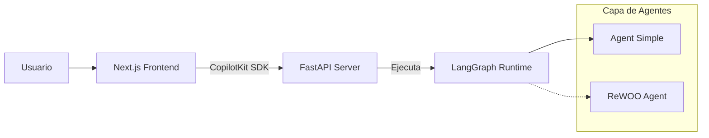

# Contexto del Proyecto: Agent January ReWOO

Este documento sirve como memoria y contexto para el desarrollo del proyecto. Contiene detalles sobre la arquitectura, el stack tecnológico y el estado actual del sistema.

## 1. Visión General
El proyecto es una aplicación de inteligencia artificial que orquesta agentes utilizando **LangGraph** y **LangChain**. El sistema expone estos agentes a través de un backend **FastAPI** que se conecta a una interfaz de usuario moderna construida con **Next.js** y **CopilotKit**.

## 2. Stack Tecnológico

### Backend & AI
*   **Lenguaje**: Python 3.12
*   **Orquestación**: LangGraph, LangChain
*   **API**: FastAPI (Standard)
*   **Modelos**: Google Gemini (gemini-2.5-flash) vía `langchain-google-genai`
*   **Dependencias Clave**: `langgraph-checkpoint-postgres`, `ragas`, `chromadb`

### Frontend (`/ui`)
*   **Framework**: Next.js 16.1.1 (App Router)
*   **Lenguaje**: TypeScript
*   **Estilos**: Tailwind CSS 4
*   **Integración AI**: CopilotKit (`@copilotkit/react-core`, `@copilotkit/react-ui`)

## 3. Arquitectura del Sistema

El flujo de datos es bidireccional entre la UI y el Backend de Agentes.



## Descripción de ReWOO básico
- Planner: genera un plan a un alto nivel para resolver el problema, incluyendo el identificar cuáles herramientas se usarán y los argumentos que requieren, potencialmente usando sustitución de variables para representar dependencias entre pasos.
La sustitución de variables en una IA que planea, especialmente con sistemas como ReWOO, habilita la creación de planes flexibles y eficientes al utilizar marcadores de posición (placeholders) para representar valores que son determinados durante la ejecución. Está técnica permite que la IA defina las dependencias entre los pasos, así como usar las salidas de una herramienta de búsqueda como la entrada para la herramienta que extrae el precio, sin la necesidad de saber valores específicos por adelantado. Al usar variables como search_result o price, la IA puede construir un plan claro de la tarea, aplazando la resolución de información dinámica hasta que esté disponible, por lo tanto se optimiza el proceso de planeación y evita cálculos innecesarios.
Prompt de ejemplo:

```
For the following task, create a series of plans that can solve the problem step-by-step. For each plan, specify which external tool and its corresponding input should be used to gather evidence. You can store the evidence in a variable #E (e.g., #E1, #E2, #E3, etc.) that can be referenced by subsequent tools. Note that all the variables are independent, so make sure to include all necessary information in each tool input.
Tools can be one of the following:
Google[input]: A search engine worker that retrieves results from Google. Use this when you need concise answers or information about a specific topic. The input should be a search query.
LLM[input]: A pretrained Large Language Model (like me). Use this when you need to leverage general world knowledge, common sense, or perform complex reasoning. Prioritize this tool when you are confident in solving the problem without external assistance. The input can be any instruction or question.
Calculator[input]: A tool that can perform mathematical calculations. Use this when you need to perform arithmetic operations. The input should be a valid mathematical expression.
WolframAlpha[input]: A computational knowledge engine. Use this when you need to solve equations, perform symbolic calculations, or get data-driven answers. The input should be a query in Wolfram Language or natural language related to a math or science problem.
For example,
Task: Alice, Bob, and Carol earned a total of $540 from their part-time jobs last week. Alice earned y dollars. Bob earned $20 more than three times what Alice earned, and Carol earned $15 more than Bob. How much money did Carol earn?
Plan: Given Alice earned y dollars, translate the problem into algebraic expressions and solve with Wolfram Alpha.
#E1 = WolframAlpha[Solve y + (3y + 20) + ((3y + 20) + 15) = 540]
Plan: Find out the amount of money Alice earned.
#E2 = LLM[What is y, given #E1]
Plan: Calculate the amount of money Carol earned.
#E3 = Calculator[((3 * #E2) + 20) + 15]
Begin!
Describe your plans with rich details. Each Plan should be followed by only one #E.
Task: {task}
```

- **Worker:** Ejecuta la herramienta con los argumentos brindados, potencialmente usando sustitución de variables de pasos anteriores.
- **Solver:** genera la respuesta final con base en las observaciones de la herramienta y el plan.

## 4. Estructura del Proyecto

### Directorio Raíz
*   `langgraph.json`: Configuración principal del CLI de LangGraph. Define el grafo activo (`simple_agent` apuntando a `src/agent/agent.py:graph`).
*   `pyproject.toml`: Gestión de dependencias (uv/pip).

### Backend (`src/`)
*   **`src/api/`**: Contiene la aplicación FastAPI (`main.py`). Actualmente configurada con CORS para la UI local.
*   **`src/agent/`**: Implementación de un agente simple.
    *   `agent.py`: Define el `StateGraph` compilado.
    *   `node.py`: Contiene la lógica del nodo, utilizando `gemini-2.5-flash`.
    *   `state.py`: Definición del estado del grafo.
*   **`src/rewoo_agent/`**: Esqueleto para una arquitectura **ReWOO** (Reasoning WithOut Observation).
    *   `graph.py`: Actualmente vacío.
    *   `nodes/`: Estructura para roles: `planner`, `worker`, `solver`, `reviewer`, `documenter`.

### Frontend (`ui/`)
*   Aplicación Next.js estándar.
*   Configurada para usar CopilotKit para componentes de chat interactivos.

## 5. Estado Actual del Desarrollo

*   **Activo**: El grafo "Simple Agent" (`src/agent`) es funcional y está registrado en `langgraph.json`.
*   **En Progreso**: La integración entre FastAPI y la UI (endpoints específicos) aún está en configuración básica.
*   **Planeado**: Implementación de la lógica ReWOO en `src/rewoo_agent` para capacidades de razonamiento complejo.

## 6. Convenciones y Notas
*   Mantener la separación clara entre la lógica del agente (grafos) y la capa de exposición (API).
*   La UI espera interactuar con el agente a través de endpoints compatibles con CopilotKit o LangGraph API.
