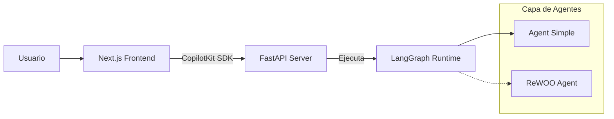

# Contexto del Proyecto: Agent January ReWOO

Este documento sirve como memoria y contexto para el desarrollo del proyecto. Contiene detalles sobre la arquitectura, el stack tecnológico y el estado actual del sistema.

## 1. Visión General
El proyecto es una aplicación de inteligencia artificial que orquesta agentes utilizando **LangGraph** y **LangChain**. El sistema expone estos agentes a través de un backend **FastAPI** que se conecta a una interfaz de usuario moderna construida con **Next.js** y **CopilotKit**.

## 2. Stack Tecnológico

### Backend & AI
*   **Lenguaje**: Python 3.12
*   **Orquestación**: LangGraph, LangChain
*   **API**: FastAPI (Standard)
*   **Modelos**: Google Gemini (gemini-2.5-flash) vía `langchain-google-genai`
*   **Dependencias Clave**: `langgraph-checkpoint-postgres`, `ragas`, `chromadb`

### Frontend (`/ui`)
*   **Framework**: Next.js 16.1.1 (App Router)
*   **Lenguaje**: TypeScript
*   **Estilos**: Tailwind CSS 4
*   **Integración AI**: CopilotKit (`@copilotkit/react-core`, `@copilotkit/react-ui`)

## 3. Arquitectura del Sistema

El flujo de datos es bidireccional entre la UI y el Backend de Agentes.

## 4. Estructura del Proyecto

### Directorio Raíz
*   `langgraph.json`: Configuración principal del CLI de LangGraph. Define el grafo activo (`simple_agent` apuntando a `src/agent/agent.py:graph`).
*   `pyproject.toml`: Gestión de dependencias (uv/pip).

### Backend (`src/`)
*   **`src/api/`**: Contiene la aplicación FastAPI (`main.py`). Actualmente configurada con CORS para la UI local.
*   **`src/agent/`**: Implementación de un agente simple.
    *   `agent.py`: Define el `StateGraph` compilado.
    *   `node.py`: Contiene la lógica del nodo, utilizando `gemini-2.5-flash`.
    *   `state.py`: Definición del estado del grafo.
*   **`src/rewoo_agent/`**: Esqueleto para una arquitectura **ReWOO** (Reasoning WithOut Observation).
    *   `graph.py`: Actualmente vacío.
    *   `nodes/`: Estructura para roles: `planner`, `worker`, `solver`, `reviewer`, `documenter`.

### Frontend (`ui/`)
*   Aplicación Next.js estándar.
*   Configurada para usar CopilotKit para componentes de chat interactivos.

## 5. Estado Actual del Desarrollo

*   **Activo**: El grafo "Simple Agent" (`src/agent`) es funcional y está registrado en `langgraph.json`.
*   **En Progreso**: La integración entre FastAPI y la UI (endpoints específicos) aún está en configuración básica.
*   **Planeado**: Implementación de la lógica ReWOO en `src/rewoo_agent` para capacidades de razonamiento complejo.

## 6. Convenciones y Notas
*   Mantener la separación clara entre la lógica del agente (grafos) y la capa de exposición (API).
*   La UI espera interactuar con el agente a través de endpoints compatibles con CopilotKit o LangGraph API.
