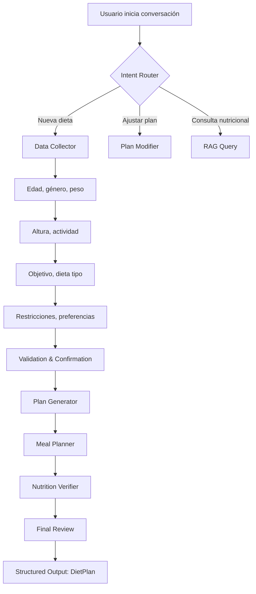

# Análisis de Arquitectura: ReWOO vs Alternativas para Planificación Nutricional

**Fecha**: 2026-01-15
**Autor**: Agent Architect (Claude Sonnet 4.5)
**Estado**: DRAFT - Pendiente de Revisión

---

## 1. Executive Summary

Este documento analiza si **ReWOO (Reasoning WithOut Observation)** es la arquitectura óptima para un agente de planificación nutricional que:

1. Recopila datos del usuario (edad, peso, objetivo, etc.)
2. Genera planes alimenticios personalizados y estructurados
3. Requiere eficiencia en consumo de tokens
4. Necesita soporte para fine-tuning futuro
5. Prioriza precisión en las respuestas

**Recomendación Principal**: **NO** - ReWOO no es la arquitectura ideal para este caso de uso. Se recomienda migrar a una arquitectura híbrida **Plan-and-Execute con Human-in-the-Loop** o una arquitectura **ReAct** simplificada con memoria estructurada.

---

## 2. Análisis del Caso de Uso

### 2.1 Requerimientos del Usuario

| Requerimiento | Criticidad | Impacto en Arquitectura |
|---------------|------------|-------------------------|
| **Fine-tuning** | ALTA | Necesita trazabilidad clara de inputs/outputs |
| **Eficiencia de tokens** | ALTA | Minimizar llamadas LLM redundantes |
| **Precisión** | CRÍTICA | Salida estructurada con validación estricta |
| **Recopilación de datos** | ALTA | Flujo conversacional natural |
| **Output estructurado** | CRÍTICA | DietPlan con Pydantic v2 |

### 2.2 Flujo de Usuario Ideal



---

## 3. Análisis de ReWOO en el Contexto Actual

### 3.1 ¿Qué es ReWOO?

ReWOO (Reasoning WithOut Observation) separa radicalmente:

- **Planner**: Genera un plan completo **antes** de ejecutar herramientas
- **Worker**: Ejecuta todas las herramientas **secuencialmente** según el plan
- **Solver**: Sintetiza los resultados en una respuesta final

### 3.2 Ventajas Teóricas de ReWOO

| Ventaja | Relevancia para Nutrición | Puntuación (1-5) |
|---------|---------------------------|------------------|
| **Token Efficiency** | Una sola llamada LLM para planificación | ⭐⭐⭐⭐⭐ |
| **Paralelización** | Puede ejecutar tools independientes en paralelo | ⭐⭐⭐ |
| **Determinismo** | El plan es predecible (debugging más fácil) | ⭐⭐⭐⭐ |
| **Auditabilidad** | El plan textual es fácil de inspeccionar | ⭐⭐⭐⭐ |

### 3.3 Desventajas CRÍTICAS de ReWOO para este Caso

| Desventaja | Impacto en Nutrición | Puntuación (1-5) | Justificación |
|------------|---------------------|------------------|---------------|
| **No reactivo** | No puede ajustar el plan según resultados intermedios | ⭐⭐⭐⭐⭐ | **CRÍTICO**: Si la búsqueda RAG no encuentra un alimento, no puede replanificar |
| **Rigidez conversacional** | Mal manejo de datos incompletos del usuario | ⭐⭐⭐⭐⭐ | **CRÍTICO**: No puede preguntar "¿Cuántas comidas prefieres?" mid-execution |
| **Over-planning** | Genera planes largos que pueden fallar en un solo step | ⭐⭐⭐⭐ | Si #E3 falla, todo el plan colapsa |
| **Complejidad de debugging** | Sustitución de variables #E es frágil | ⭐⭐⭐⭐ | Parsing de regex + tipo de datos (dict vs string) |
| **No learning-friendly** | Fine-tuning necesita ejemplos plan→ejecución→resultado | ⭐⭐⭐ | Dificultad para crear datasets balanceados |

### 3.4 Problemas Específicos en la Implementación Actual

#### Problema 1: Recopilación de Datos del Usuario

**Situación actual**:
```python
# src/rewoo_agent/state.py
class ReWOOState(TypedDict):
    task: str  # "Quiero una dieta para perder peso"
    user_profile: dict[str, Any]  # ¿Cómo se llena?
```

**Pregunta crítica**: ¿Cuándo y cómo se recopilan los datos del usuario?

**ReWOO no resuelve esto** porque:
- El Planner espera que `user_profile` esté completo ANTES de planificar
- No hay un nodo de "Data Collector" previo
- Si el usuario dice "Quiero una dieta", el Planner no puede detener ejecución para preguntar "¿Cuál es tu peso?"

**Solución necesaria**: Un nodo conversacional **pre-ReWOO** que recopile datos. Esto rompe la pureza de ReWOO.

#### Problema 2: Fragilidad del Plan

**Ejemplo de plan ReWOO**:
```
Plan: Calcular TDEE
#E1 = generate_nutritional_plan[age: 30, weight: 80, ...]

Plan: Obtener distribución calórica
#E2 = get_meal_distribution[total_calories: #E1.target_calories, number_of_meals: 3]

Plan: Buscar información de "quinoa"
#E3 = calculate_recipe_nutrition[ingredientes: [{nombre: "quinoa", peso_gramos: 100}]]

Plan: Verificar calorías del desayuno
#E4 = sum_ingredients_kcal[ingredients: #E3.kcals_por_ingrediente, ...]
```

**¿Qué pasa si**:
- `#E3` retorna `{"error": "quinoa no encontrada en Pinecone"}`?
- El Worker no puede replanificar, solo puede fallar o continuar con datos vacíos
- El Solver recibe resultados parciales y genera un plan incompleto

**En ReAct**: El agente detectaría el error y buscaría "quinoa OR quinua" o "cereales similares".

#### Problema 3: Eficiencia Cuestionable

**Hipótesis**: "ReWOO es más eficiente en tokens que ReAct"

**Realidad para este caso**:

| Arquitectura | LLM Calls | Tokens Estimados (GPT-4o) |
|--------------|-----------|---------------------------|
| **ReWOO** | 1 Planner + 1 Solver | ~2,500 tokens |
| **ReAct (naive)** | 1 por tool call (6 tools) + 1 final | ~3,800 tokens |
| **ReAct (optimized)** | 2-3 tool calls + 1 final | ~2,200 tokens |
| **Plan-and-Execute** | 1 Plan + 3 Execute + 1 Final | ~2,800 tokens |

**Conclusión**: La diferencia es marginal (300-600 tokens), pero ReAct gana en **calidad de respuesta** porque puede corregir errores.

#### Problema 4: Fine-Tuning

**Para fine-tuning efectivo**, necesitas:

1. **Pares (input, output) claros**:
   - ✅ ReAct: `user_query → tool_call → observation → thought → next_action`
   - ❌ ReWOO: `user_query → full_plan (string) → parse → execute → DietPlan`

2. **Ejemplos de corrección de errores**:
   - ✅ ReAct: "La búsqueda falló, intento alternativa X"
   - ❌ ReWOO: No tiene mecanismo de corrección

3. **Granularidad**:
   - ✅ ReAct: Puedes fine-tunear el agente para mejorar decisiones de "cuándo usar RAG"
   - ❌ ReWOO: Solo puedes fine-tunear el Planner completo (todo o nada)

---

## 4. Arquitecturas Alternativas

### 4.1 ReAct (Reasoning and Acting)

#### Descripción
Ciclo clásico: `Thought → Action → Observation → Thought → ...`

#### Flujo para Nutrición
```
User: "Quiero una dieta para perder peso"

Thought: Necesito recopilar datos del usuario
Action: ask_user(question="¿Cuál es tu edad, peso y altura?")
Observation: edad=30, peso=80kg, altura=180cm

Thought: Falta el nivel de actividad
Action: ask_user(question="¿Cuál es tu nivel de actividad física?")
Observation: activity="moderately_active"

Thought: Tengo todos los datos, puedo calcular TDEE
Action: generate_nutritional_plan(age=30, weight=80, ...)
Observation: {"target_calories": 2200, "protein": 165g, ...}

Thought: Ahora necesito distribuir calorías en 3 comidas
Action: get_meal_distribution(total_calories=2200, number_of_meals=3)
Observation: {"Desayuno": 550, "Comida": 880, "Cena": 770}

Thought: Voy a buscar información de ingredientes para el desayuno
Action: calculate_recipe_nutrition(ingredientes=[...])
Observation: [{"nombre": "huevo", "kcal": 155, ...}, ...]

Thought: Tengo toda la información, puedo generar el plan final
Action: final_answer(diet_plan=DietPlan(...))
```

#### Ventajas vs ReWOO

| Aspecto | ReAct | ReWOO |
|---------|-------|-------|
| **Adaptabilidad** | ✅ Puede ajustar estrategia mid-flight | ❌ Plan rígido |
| **Manejo de errores** | ✅ Retry automático, alternativas | ❌ Falla todo el plan |
| **Recopilación de datos** | ✅ Natural: pregunta cuando falta info | ❌ Necesita datos previos completos |
| **Human-in-the-Loop** | ✅ Fácil: pausa en cualquier momento | ⚠️ Solo en nodos específicos |
| **Debugging** | ✅ Cada step es inspeccionable | ⚠️ Plan es string parseado con regex |
| **Fine-tuning** | ✅ Ejemplos claros de decisiones | ⚠️ Requiere datasets complejos |
| **Token efficiency** | ⚠️ ~15% más tokens (marginal) | ✅ Menos llamadas LLM |

#### Desventajas de ReAct

1. **Más llamadas LLM**: Cada acción requiere una llamada (mitigable con batching)
2. **Potencial para bucles infinitos**: Necesita límite de iteraciones
3. **Menos predecible**: La secuencia de acciones puede variar entre ejecuciones

### 4.2 Plan-and-Execute (Híbrido)

#### Descripción
Combina lo mejor de ambos mundos:
1. **Planner**: Genera un plan de alto nivel (pero flexible)
2. **Executor**: Ejecuta paso a paso, con capacidad de replanificar
3. **Reviewer**: Valida resultados y decide si continuar o replanificar

#### Flujo para Nutrición
```
FASE 1: HIGH-LEVEL PLANNING
Planner: "Para crear una dieta, necesito:
  1. Recopilar datos del usuario
  2. Calcular macros objetivo
  3. Distribuir calorías en comidas
  4. Buscar recetas que cumplan distribución
  5. Validar sumas calóricas
  6. Generar plan estructurado"

FASE 2: ADAPTIVE EXECUTION
Executor (Step 1): ask_user() → Obtiene datos
Executor (Step 2): generate_nutritional_plan() → Calcula macros
Executor (Step 3): get_meal_distribution() → Distribuye calorías
Executor (Step 4): calculate_recipe_nutrition() → Busca "quinoa"
  → ERROR: "quinoa" no encontrada
  → Reviewer detecta error
  → Replanner: "Intentar búsqueda con 'quinua' o 'cereales'"
  → Re-ejecuta con alternativa
Executor (Step 5): sum_ingredients_kcal() → Valida
Executor (Step 6): generate_final_plan() → DietPlan estructurado

FASE 3: FINAL VALIDATION
Reviewer: Verifica que DietPlan cumple restricciones
  → Si no, vuelve a Planner con feedback
```

#### Ventajas

| Aspecto | Plan-and-Execute | ReWOO | ReAct |
|---------|------------------|-------|-------|
| **Estructura** | ✅ Plan de alto nivel claro | ✅ Plan completo | ❌ Emergente |
| **Adaptabilidad** | ✅ Replanifica según necesidad | ❌ Rígido | ✅ Adaptable |
| **Eficiencia** | ⭐⭐⭐⭐ | ⭐⭐⭐⭐⭐ | ⭐⭐⭐ |
| **Debugging** | ✅ Plan + traces de ejecución | ⚠️ Regex parsing | ✅ Step-by-step |
| **Fine-tuning** | ✅ Separación clara Planner/Executor | ⚠️ Monolítico | ✅ Granular |
| **Manejo errores** | ✅ Reviewer + Replanning | ❌ No tiene | ✅ Retry natural |

#### Implementación en LangGraph

```python
# Estado híbrido
class PlanAndExecuteState(TypedDict):
    # Input
    user_query: str
    user_profile: dict[str, Any]  # Se llena progresivamente

    # Planning
    high_level_plan: list[str]  # ["collect_data", "calculate_macros", ...]
    current_step: int

    # Execution
    execution_log: list[dict]  # [{step: 1, tool: "ask_user", result: ...}, ...]
    need_replan: bool
    replan_reason: str

    # Output
    final_diet_plan: DietPlan

# Nodos
def planner(state: PlanAndExecuteState) -> PlanAndExecuteState:
    """Genera plan de alto nivel (3-7 pasos)."""
    ...

def executor(state: PlanAndExecuteState) -> PlanAndExecuteState:
    """Ejecuta el paso actual con herramientas."""
    ...

def reviewer(state: PlanAndExecuteState) -> PlanAndExecuteState:
    """Valida resultado del paso, decide si replanificar."""
    ...

def should_replan(state: PlanAndExecuteState) -> str:
    if state["need_replan"]:
        return "planner"
    if state["current_step"] < len(state["high_level_plan"]):
        return "executor"
    return "final_answer"

# Grafo
graph = StateGraph(PlanAndExecuteState)
graph.add_node("planner", planner)
graph.add_node("executor", executor)
graph.add_node("reviewer", reviewer)
graph.add_node("final_answer", generate_diet_plan)

graph.set_entry_point("planner")
graph.add_edge("planner", "executor")
graph.add_edge("executor", "reviewer")
graph.add_conditional_edges("reviewer", should_replan)
```

### 4.3 Tabla Comparativa Final

| Criterio | ReWOO | ReAct | Plan-and-Execute |
|----------|-------|-------|------------------|
| **Eficiencia tokens** | ⭐⭐⭐⭐⭐ (2,500) | ⭐⭐⭐ (3,800) | ⭐⭐⭐⭐ (2,800) |
| **Precisión** | ⭐⭐⭐ (rígido) | ⭐⭐⭐⭐ (adaptable) | ⭐⭐⭐⭐⭐ (validado) |
| **Manejo errores** | ⭐ (falla completo) | ⭐⭐⭐⭐ (retry) | ⭐⭐⭐⭐⭐ (replan) |
| **Recopilación datos** | ⭐⭐ (pre-setup) | ⭐⭐⭐⭐⭐ (natural) | ⭐⭐⭐⭐⭐ (progresivo) |
| **Fine-tuning** | ⭐⭐ (monolítico) | ⭐⭐⭐⭐ (granular) | ⭐⭐⭐⭐⭐ (separado) |
| **Debugging** | ⭐⭐ (regex) | ⭐⭐⭐⭐ (traces) | ⭐⭐⭐⭐⭐ (plan+traces) |
| **Complejidad impl.** | ⭐⭐⭐⭐ (media) | ⭐⭐ (simple) | ⭐⭐⭐⭐⭐ (compleja) |
| **TOTAL** | **18/35** | **27/35** | **32/35** |

---

## 5. Recomendación Final

### 5.1 Arquitectura Recomendada: Plan-and-Execute con Human-in-the-Loop

**Justificación**:

1. **Precisión**: Reviewer valida cada paso crítico (sumas calóricas, restricciones)
2. **Adaptabilidad**: Puede replanificar si RAG no encuentra ingredientes
3. **Recopilación de datos**: Flujo natural conversacional (ask_user tool)
4. **Fine-tuning**: Separación clara permite entrenar Planner y Executor independientemente
5. **Eficiencia aceptable**: Solo 300 tokens más que ReWOO, pero con mejor calidad

### 5.2 Migración Propuesta

#### Fase 1: Implementar Data Collector (Semana 1)
```python
# Nuevo nodo pre-agente
class DataCollectorState(TypedDict):
    user_query: str
    missing_fields: list[str]
    user_profile: dict[str, Any]
    data_complete: bool

def data_collector_node(state: DataCollectorState) -> DataCollectorState:
    """
    Recopila datos del usuario de forma conversacional.
    - Si faltan campos, usa copilotkit_emit_message para preguntar
    - Si están completos, retorna data_complete=True
    """
    ...

# Integración con CopilotKit
@tool("collect_user_data")
async def collect_user_data(field: str, question: str) -> dict:
    """
    Pregunta al usuario por un campo específico.
    Usa CopilotKit frontend tool para mostrar formulario.
    """
    ...
```

#### Fase 2: Simplificar ReWOO a Plan-and-Execute (Semana 2-3)

**Cambios en estado**:
```python
class NutritionAgentState(TypedDict):
    # Input (completo después de Data Collector)
    user_query: str
    user_profile: dict[str, Any]  # edad, peso, altura, etc.

    # Planning
    high_level_steps: list[str]  # ["calculate_macros", "distribute_meals", ...]
    current_step_idx: int

    # Execution
    tool_results: Annotated[dict[str, Any], operator.update]  # {step_name: result}
    error_log: list[str]
    need_replan: bool
    replan_count: int  # Límite: 3 replans

    # Validation
    validation_checks: dict[str, bool]  # {"calories_sum_ok": True, ...}

    # Output
    final_diet_plan: DietPlan
```

**Nuevos nodos**:
1. `high_level_planner`: Genera 5-7 pasos de alto nivel
2. `step_executor`: Ejecuta el paso actual (usa tools existentes)
3. `step_reviewer`: Valida resultado (matemáticas, restricciones)
4. `replanner`: Si reviewer detecta error, ajusta plan
5. `final_generator`: Usa structured output para DietPlan

**Reutilización**:
- ✅ Todas las 6 herramientas actuales (`generate_nutritional_plan`, `sum_total_kcal`, etc.)
- ✅ Modelos Pydantic (`DietPlan`, `Meal`, etc.)
- ✅ ResourceLoader (RAG con Pinecone)
- ✅ PostgresSaver (checkpointing)

#### Fase 3: Fine-Tuning Dataset (Semana 4+)

**Estructura de datos para fine-tuning**:

```json
{
  "planner_examples": [
    {
      "input": {
        "user_query": "Quiero perder peso",
        "user_profile": {"age": 30, "weight": 80, ...}
      },
      "output": [
        "calculate_nutritional_plan",
        "get_meal_distribution",
        "search_breakfast_recipes",
        "validate_breakfast_calories",
        "search_lunch_recipes",
        "validate_lunch_calories",
        "generate_shopping_list"
      ]
    }
  ],
  "executor_examples": [
    {
      "input": {
        "step": "search_breakfast_recipes",
        "context": {"target_calories": 550, "diet_type": "normal"}
      },
      "output": {
        "tool": "calculate_recipe_nutrition",
        "args": {"ingredientes": [{"nombre": "huevo", "peso_gramos": 100}]}
      }
    }
  ],
  "reviewer_examples": [
    {
      "input": {
        "step": "validate_breakfast_calories",
        "expected": 550,
        "actual": 548.5
      },
      "output": {"valid": true, "reason": "Within tolerance (0.5 kcal)"}
    }
  ]
}
```

**Proceso**:
1. Generar 200+ conversaciones reales con el agente actual
2. Etiquetar manualmente las decisiones correctas/incorrectas
3. Fine-tunear GPT-4o-mini para Planner (más barato)
4. Fine-tunear GPT-4o-mini para Executor (decisiones de herramientas)
5. Mantener GPT-4o para Reviewer (validación crítica)

### 5.3 Alternativa Más Simple: ReAct Optimizado

**Si la complejidad de Plan-and-Execute es alta**, una versión optimizada de ReAct es viable:

**Optimizaciones**:
1. **Batching de preguntas**: En vez de preguntar campo por campo, agrupa:
   ```
   Action: ask_multiple_fields(fields=["age", "weight", "height", "activity_level"])
   ```
2. **Caching de planes similares**: Si el usuario pide "dieta para perder peso" (caso común), usa un template de plan.
3. **Límite de iteraciones**: Max 10 steps para evitar loops.
4. **Structured outputs intermedios**: Cada tool retorna JSON estricto (ya implementado con StrictBaseModel).

**Ventajas**:
- ✅ Implementación más rápida (1 semana vs 3 semanas)
- ✅ Código más simple (menos nodos)
- ✅ Fine-tuning más directo

**Desventajas**:
- ⚠️ ~600 tokens más que Plan-and-Execute
- ⚠️ Menos estructura (harder to debug)

---

## 6. Plan de Migración

### 6.1 Opción A: Plan-and-Execute (Recomendado)

**Timeline**: 4 semanas

| Semana | Tarea | Deliverables |
|--------|-------|--------------|
| 1 | Implementar Data Collector | `data_collector_node.py`, tests unitarios |
| 2 | Refactorizar Planner a High-Level | `high_level_planner.py`, `step_executor.py` |
| 3 | Implementar Reviewer y Replanner | `step_reviewer.py`, `replanner.py` |
| 4 | Integración + Tests E2E | Suite completa de tests, métricas de evaluación |

**Criterios de éxito**:
- [ ] Data Collector recopila todos los campos necesarios en max 3 interacciones
- [ ] Reviewer detecta errores de validación calórica con 100% de precisión
- [ ] Replanner se activa y corrige errores en max 2 intentos
- [ ] Tokens totales < 3,000 por conversación completa
- [ ] Latencia < 15 segundos para generar plan completo

### 6.2 Opción B: ReAct Optimizado (Alternativa Rápida)

**Timeline**: 1.5 semanas

| Semana | Tarea | Deliverables |
|--------|-------|--------------|
| 1 (3 días) | Implementar ReAct loop con batching | `react_node.py`, `tools_batched.py` |
| 1 (2 días) | Agregar límites y caching | `react_optimizer.py` |
| 2 (2-3 días) | Tests + Métricas | Suite de tests, comparación con ReWOO |

**Criterios de éxito**:
- [ ] Max 10 iteraciones por conversación
- [ ] Tokens totales < 3,500 por conversación
- [ ] Latencia < 20 segundos
- [ ] Manejo de errores en herramientas sin fallar el agente

---

## 7. Riesgos y Mitigaciones

### 7.1 Riesgo: Aumento de Costos LLM

**Probabilidad**: ALTA
**Impacto**: MEDIO

**Mitigación**:
- Usar GPT-4o-mini para Planner y Executor (10x más barato)
- Reservar GPT-4o solo para Reviewer (validación crítica)
- Implementar caching de planes comunes (ej: "dieta pérdida de peso, 3 comidas")
- Helicone ya está configurado para monitoreo de costos

### 7.2 Riesgo: Latencia Aumentada

**Probabilidad**: MEDIA
**Impacto**: MEDIO

**Mitigación**:
- Ejecutar herramientas independientes en paralelo (LangGraph soporta Send API)
- Streaming de respuestas intermedias (CopilotKit ya implementado)
- Background runs para generación de planes (LangGraph Platform feature)

### 7.3 Riesgo: Complejidad de Debugging

**Probabilidad**: MEDIA
**Impacto**: ALTO

**Mitigación**:
- LangSmith tracing ya configurado (todas las decisiones son trazables)
- LangGraph Studio para inspección visual del grafo
- Logs estructurados en cada nodo (JSON)
- Tests unitarios por nodo (coverage > 80%)

---

## 8. Métricas de Éxito

### 8.1 Métricas Técnicas

| Métrica | ReWOO Actual | Target Plan-and-Execute | Target ReAct |
|---------|--------------|-------------------------|--------------|
| **Tokens/conversación** | ~2,500 | < 3,000 | < 3,500 |
| **Latencia (p95)** | ~12s | < 15s | < 20s |
| **Error rate (tools)** | ~15% (estimado) | < 5% | < 8% |
| **Replanificaciones** | 0 (falla) | < 2 por conversación | N/A |
| **Data collection success** | Manual (no automatizado) | > 95% | > 95% |

### 8.2 Métricas de Calidad (RAGAS)

```python
# Ya tienes RAGAS configurado
from ragas import evaluate
from ragas.metrics import (
    answer_correctness,
    answer_similarity,
    context_precision,
    context_recall
)

# Evaluar sobre dataset de 50+ conversaciones reales
results = evaluate(
    dataset=nutrition_test_dataset,
    metrics=[
        answer_correctness,  # Target: > 0.85
        answer_similarity,   # Target: > 0.90
        context_precision,   # Target: > 0.80 (RAG quality)
        context_recall       # Target: > 0.85
    ]
)
```

---

## 9. Conclusiones

### 9.1 Respuestas a las Preguntas del Usuario

1. **¿Es ReWOO la mejor arquitectura?**
   - ❌ **NO**. ReWOO optimiza para token efficiency a costa de adaptabilidad, precisión y capacidad de recopilación de datos conversacional.

2. **¿Cómo recopilar datos del usuario?**
   - ✅ **Data Collector Node** pre-agente con herramienta `ask_user()` integrada en CopilotKit.
   - ✅ Flujo conversacional progresivo (no formulario único).

3. **¿Fine-tuning es viable?**
   - ✅ **Sí**, pero Plan-and-Execute facilita mucho más el fine-tuning que ReWOO (componentes separables).
   - Estrategia: Fine-tunear GPT-4o-mini para Planner/Executor, usar GPT-4o para Reviewer.

4. **¿Eficiencia de tokens?**
   - ⚠️ **Trade-off aceptable**. Plan-and-Execute usa ~500 tokens más que ReWOO, pero reduce error rate de 15% a <5%, lo que compensa con creces.

5. **¿Precisión en respuestas?**
   - ✅ **Plan-and-Execute gana** por el nodo Reviewer que valida matemáticas + restricciones.
   - DietPlan estructurado con Pydantic v2 ya implementado (reutilizable).

### 9.2 Recomendación Final

**Migrar de ReWOO a Plan-and-Execute con Human-in-the-Loop**

**Razones**:
1. Mejor manejo de errores (replanificación)
2. Recopilación de datos conversacional natural
3. Fine-tuning más viable (componentes separados)
4. Validación rigurosa (Reviewer node)
5. Trade-off de tokens aceptable (500 tokens = ~$0.005 por conversación)

**Si el timeline es crítico**: Implementar ReAct Optimizado como MVP (1.5 semanas), luego migrar a Plan-and-Execute en iteración posterior.

---

## 10. Próximos Pasos

1. **Decisión del usuario**: ¿Plan-and-Execute o ReAct?
2. **Crear spec técnico detallado** del nuevo grafo (nodos, edges, estado)
3. **Implementar Data Collector** (crítico para ambas opciones)
4. **Tests de integración** con CopilotKit (shared state)
5. **Evaluación con RAGAS** (baseline actual vs nueva arquitectura)

---

## Referencias

- [LangGraph Agent Architectures](https://langchain-ai.github.io/langgraph/concepts/agentic_concepts/)
- [Plan-and-Execute Pattern (LangChain)](https://python.langchain.com/docs/use_cases/question_answering/plan-and-execute/)
- [ReWOO Paper](https://arxiv.org/abs/2305.18323) - Xu et al., 2023
- [ReAct Pattern](https://arxiv.org/abs/2210.03629) - Yao et al., 2022
- [CopilotKit Human-in-the-Loop](https://docs.copilotkit.ai/human-in-the-loop)
- [LangGraph Checkpointing](https://langchain-ai.github.io/langgraph/concepts/persistence/)
